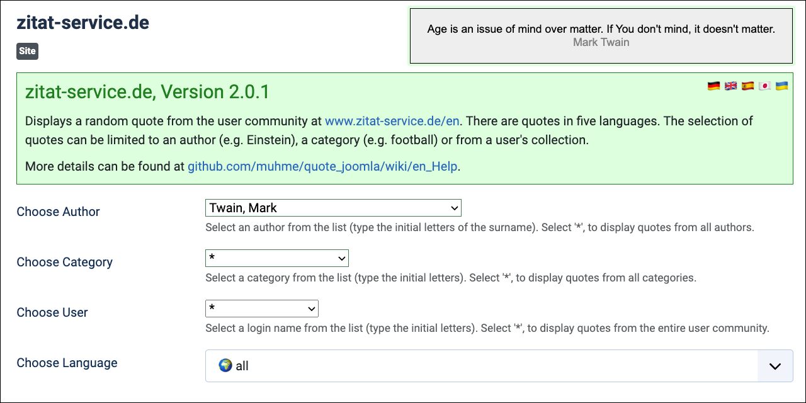

# quote_joomla



Joomla module `mod_zitat_service_de` to display random quotes from community [zitat-service.de](https://www.zitat-service.de).

Help for the Joomla module administration is available in five languages at [https://github.com/muhme/quote_joomla/wiki](https://github.com/muhme/quote_joomla/wiki).

Tested Joomla/PHP versions are:
| Joomla | PHP |
|--------|-----|
| 3.10   | 8.0 |
| 4.4    | 8.1 |
| 5.0    | 8.2 |

## Test & Development Environment
<details>
  <summary>There is a docker test and development environment prepared, including automated Cypress installation.</summary>

### Docker Containers

As a prerequisite, [git](https://git-scm.com/), [docker](https://www.docker.com/) and [npm](https://www.npmjs.com/) must be installed (under Microsoft Windows in [WSL2](https://learn.microsoft.com/de-de/windows/wsl/install)). To create your test and development environment run:

```
host$ git clone https://github.com/muhme/quote_joomla
host$ cd quote_joomla
host$ docker compose up -d
```

Six Docker containers are running:

```
host$ docker ps
IMAGE                   PORTS                  NAMES
mysql                   3306/tcp, 33060/tcp    quote_joomla_mysql
phpmyadmin/phpmyadmin   0.0.0.0:2001->80/tcp   quote_joomla_mysqladmin
joomla:3                0.0.0.0:2003->80/tcp   quote_joomla_3
joomla:4                0.0.0.0:2004->80/tcp   quote_joomla_4
joomla:5.0              0.0.0.0:2005->80/tcp   quote_joomla_5
cypress/included        0.0.0.0:2080->80/tcp   quote_joomla_cypress
```

Available Ports are:
- http://localhost:2001 – phpMyAdmin (database user root/root already set)
- http://localhost:2003 – Joomla 3, ready for installation
- http://localhost:2004 – Joomla 4, ready for installation
- http://localhost:2005 – Joomla 5, ready for installation

### Cypress

[Cypress](https://cypress.io) is used for running Joomla installation and for the automated end-to-end tests. This is described in detail in subfolder [test](./test/).

### Scripts

There are scripts prepared for a more pleasant and also faster development, see folder [scripts](./scripts/) and commented list of scripts there.

### Development

For development purposes, it is useful to synchronise the files from the host with the Joomla module inside the Docker container in order to test changes immediately. The current host folder is already mapped in the docker container as `/quote_joomla` for module installation. After installing the module, the mapped files can then be used directly with a symbolic link, e.g. for the Joomla 5 container:
```
host$ docker exec -it quote_joomla_5 bash
quote_joomla_5# cd /var/www/html/modules
quote_joomla_5# rm -r mod_zitat_service_de
quote_joomla_5# ln -s /quote_joomla mod_zitat_service_de
```

:point_right: The script `scripts/exec.sh` not only runs an interactive shell within the container, but also creates this symbolic link.

> :warning: **Caution:** If you uninstall the module in Joomla after symbolic linking the module folder you delete all source files in your host folder! :point_right: Inside container, you have to delete symbolic link before.

</details>

## API zitat-service.de

The Joomla module fetches all data from <a href="https://api.zitat-service.de">api.zitat-service.de</a>. Terms of use and privacy statement can be found in the <a href="https://www.zitat-service.de/en/start/contact">Imprint</a>.

## License

MIT License, Copyright (c) 2008 - 2023 Heiko Lübbe, see [LICENSE](LICENSE)

## Contact

Don't hesitate to ask if you have any questions or comments. If you encounter any problems or have suggestions for enhancements, please feel free to [open an issue](../../issues).
