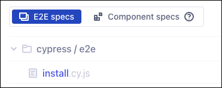

# quote_joomla
Joomla! module for zitat-service.de

Prepared for Joomla versions 3, 4 and 5. But today it is necessary to note:
* the Joomla! module is still using the old API (Perl script) at the moment and the goal is it to migrate to the new OpenAPI [api.zitat-service.de](https://api.zitat-service.de/)
* Joomla 3 – the automatic installation with Cypress does not work here (currently)
* Joomla 4 - the automatic installation with Cypress works only partially (need fixes in joomla-cypress - under work)
* Joomla 5 - module is not migrated yet

## Installation

### Docker Containers

There is a Docker based test and development environment prepared:

```
$ git clone https://github.com/muhme/quote_joomla
$ cd quote_joomla
$ docker compose up -d
```

Six Docker containers are running:

```
$ docker ps
IMAGE                   PORTS                  NAMES
mysql                   3306/tcp, 33060/tcp    quote_joomla_mysql
phpmyadmin/phpmyadmin   0.0.0.0:2001->80/tcp   quote_joomla_mysqladmin
joomla:3                0.0.0.0:2003->80/tcp   quote_joomla_3
joomla:4                0.0.0.0:2004->80/tcp   quote_joomla_4
joomla:5.0              0.0.0.0:2005->80/tcp   quote_joomla_5
cypress/included        0.0.0.0:2080->80/tcp   quote_joomla_cypress

```

- quote_joomla_mysql – MySQL database server
  - admin user is root/root
- quote_joomla_mysqladmin – phpMyAdmin (user root/root)
  - http://localhost:2001
- quote_joomla_3 – Joomla! 3, ready for installation
  - http://localhost:2003
- quote_joomla_4 – Joomla! 4, ready for installation
  - http://localhost:2003
- quote_joomla_5 – Joomla! 5, ready for installation
  - http://localhost:2003

### joomla-cypress

As a base for the Cypress test automation [joomla-projects/joomla-cypress](https://github.com/joomla-projects/joomla-cypress) is used. Currently my fork is used until all fixes and pull request are done. To install the dependencies do:
```
$ npm i
```

## Testing
You can choose the desired Joomla! version with environment variable `JOOMLA_VERSION`. [Cypress](https://www.cypress.io/) can be started inside subfolder `cypress`.
```
$ cd cypress
$ JOOMLA_VERSION=4 npx cypress open
```

In Cypress, you use E2E Testing, launch your favorite browser and with the install.cy.js script you have automatic Joomla and module installation. This needs to be run once after Docker containers are created.


